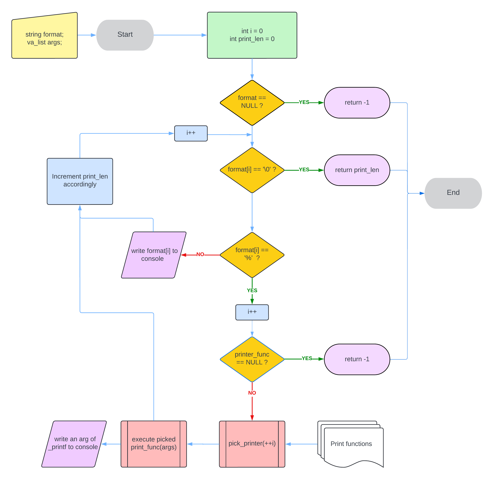

# _printf

## Description
The _printf project is an assignment given during our studies at Holberton School.
The goal of this project was to recreate the printf() function, with basic functionnalities. It must be able to output following a format string, and recognize conversion specifiers to print variables accordingly.
For completing the mandatory tasks, we provided support for the following conversion specifiers:

| Conversion specifier | Printed data type |
| -------------        | -------------     |
| %c                   | A single char     |
| %s                   | A string          |
| %%                   | A single %        |
| %i                   | An integer        |
| %d                   | An integer        |

_printf() also returns the length of what it printed (excluding the ending null byte), exactly like the original function.

## Compilation / Installation

First, clone the repo using `git clone https://github.com/ClaymeCall/holbertonschool-printf.git`

To compile the program as we did it, clone the repo, add a file containing your main function, and compile the whole program using the following command:
`gcc -Wall -Werror -Wextra -pedantic -std=gnu89 -Wno-format *.c`
(You can change the name of the binary file with the -o <file_name.out>)

The resulting executable file can be run using `./file_name.out`.

## Requirements for the project
- Only allowed text editors were Vim or Emacs (Not even a dilemma)
- All files were compiled on Ubuntu 20.04 using the above gcc command.
- All of the code is following [Betty coding style rules](https://github.com/hs-hq/Betty/wiki)
- We were not allowed to use global variables
- We had an allowed maximum of 5 function per files

## Examples

Here are examples of the function being used for the 5 handled conversion specifiers:

### Single character printing :
Expected output: A  
`printf("%c", 'A')` -> : `A`  
`_printf("%c", 'A')` -> : `A`  
printf returned: 1, _printf returned: 1

### String printing :
Expected output: Hello  
`printf("%s", 'Hello')` -> : `Hello`  
`_printf("%s", 'Hello')` -> : `Hello`  
printf returned: 5, _printf returned: 5

### Int printing :
Expected output: 15  
`printf("%i", 15)` -> : `15`  
`_printf("%i", 15)` -> : `15`  
printf returned: 2, _printf returned: 2

### Negative int printing :
Expected output: -15  
`printf("%d", -15)` -> : `-15`  
`_printf("%d", -15)` -> : `-15`  
printf returned: 3, _printf returned: 3

### Percentage printing :
Expected output: %  
`printf("%%")` -> : `%`  
`_printf("%%")` -> : `%`  
printf returned: 1, _printf returned: 1 

## Testing

To test the function, we used the files located in the /tests directory.
The holberton_test.c contain a main function given by Holberton. We also made our own unit tests that contain only the requirement for the mandatory tasks, for the sake of clarity.

For ease of use, the associated bash scripts will compile all the function files with the adequate tester main function, run the binary and delete it afterwards.

As we used the malloc and free functions in our code, we checked for memory leaks using Valgrind, with the following command the executable: `valgrind --leak-check=full ./a.out`

## Flowchart

## Authors

C#24 : [Mael EZANIC](https://github.com/Mezanic) | [Clément CALLEJON](https://github.com/ClaymeCall) | [Christopher SAYAD](https://github.com/Chrissayad31)
